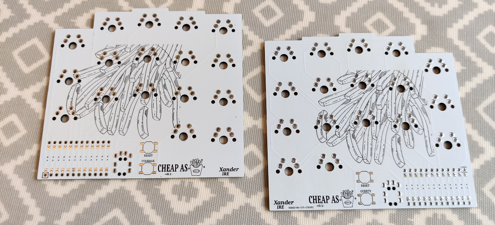
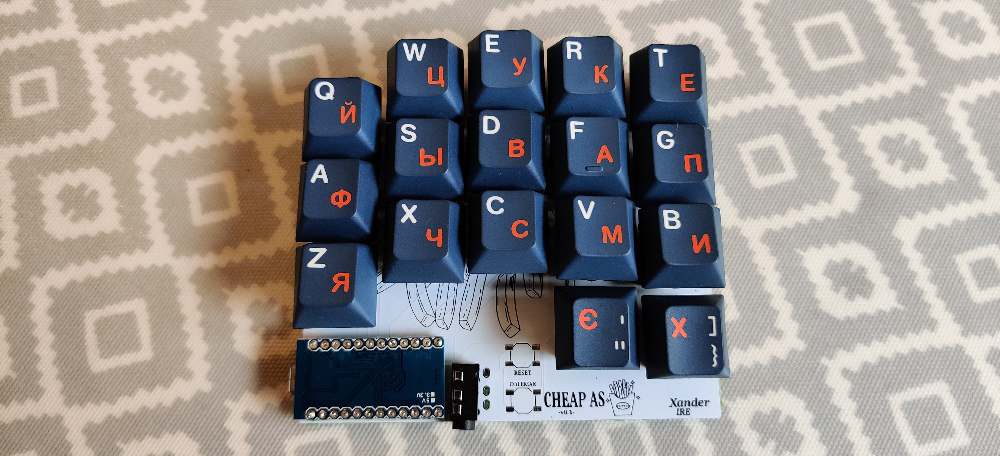

# chips-34

Prototype, diodless pcb with minor key stagger and two thumb keys.

This started as a project to learn [Ergogen](https://github.com/ergogen/ergogen) and [KiCad](https://www.kicad.org/)

- Work-in-progress pcb that is under **100mm x 100mm** in order to facilitate a common discounted price for pcb manufactures for small pcbs.

---

## BOM

| Components                                              | Amount |
| :------------------------------------------------------ | :----: |
| Arduino Pro Micro                                       | 2      |
| TRRS-PJ-320A-dual                                       | 2      |
| SPST Tactile Switch                                     | 4      |
| MX Switches                                             | 34     |
| MX Keycaps                                              | 34     |

---

## Images

[(Back to top)](#chips-34)
